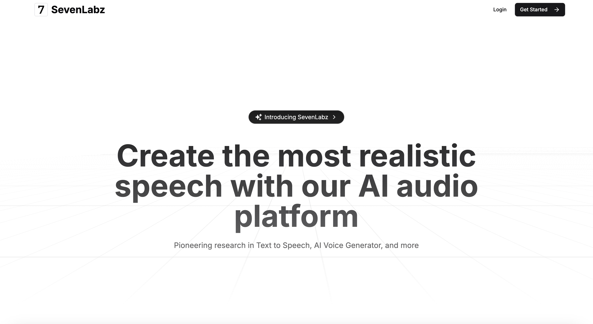

<div align="center">
  <br />
    <a href="https://youtu.be/lie0cr3wESQ" target="_blank">
      
    </a>
  <br />

  <div>
     
    
    
    
  </div>

<h3 align="center">SevenLabz</h3>

   <div align="center">
     Build this project step by step with our detailed tutorial on <a href="https://www.youtube.com/@jswithjohn" target="_blank"><b>Js with John</b></a> YouTube. Join the family!
    </div>
</div>

## 📋 <a name="table">Table of Contents</a>

1. 🤖 [Introduction](#introduction)
2. ⚙️ [Tech Stack](#tech-stack)
3. 🔋 [Features](#features)
4. 🤸 [Quick Start](#quick-start)
5. 🕸️ [Snippets (Code to Copy)](#snippets)
6. 🔗 [Assets](#links)
7. 🚀 [More](#more)

## 🚨 Tutorial

This repository contains the code corresponding to an in-depth tutorial available on our YouTube
channel, <a href="https://www.youtube.com/@jswithjohn" target="_blank"><b>Js with John</b></a>.

If you prefer visual learning, this is the perfect resource for you. Follow our tutorial to learn how to build projects
like these step-by-step in a beginner-friendly manner!

<a href="https://www.youtube.com/@jswithjohn" target="_blank"></a>

## <a name="introduction">🤖 Introduction</a>

A AI Audio Platform. Built with the latest Next.js 15 and the Appwrite Node SDK.

If you're getting started and need assistance or face any bugs, please send a message to me.

## <a name="tech-stack">⚙️ Tech Stack</a>

- React 19
- Next.js 15
- Appwrite
- TailwindCSS
- ShadCN
- TypeScript
- ElevenLabs API

## <a name="features">🔋 Features</a>

👉 **User Authentication with Clerk**: Implement google login, and logout functionality using Clerk authentication system.

👉 **View and Manage Audios**: Users can browse through their files audios in Appwrite .

👉 **Download Audios**: Users can download their audios.

👉 **Modern Responsive Design**: A fresh and minimalist UI that emphasizes usability, ensuring a clean aesthetic across all devices.

and many more, including the latest **React 19**, **Next.js 15** and **Appwrite** features alongside code architecture and
reusability

## <a name="quick-start">🤸 Quick Start</a>

Follow these steps to set up the project locally on your machine.

**Prerequisites**

Make sure you have the following installed on your machine:

- [Git](https://git-scm.com/)
- [Node.js](https://nodejs.org/en)
- [npm](https://www.npmjs.com/) (Node Package Manager)

**Cloning the Repository**

```bash
git clone https://github.com/jovimoura/sevenlabs
cd sevenlabs
```

**Installation**

Install the project dependencies using npm:

```bash
npm install
```

**Set Up Environment Variables**

Create a new file named `.env.local` in the root of your project and add the following content:

```env
ELEVENLABS_API_KEY=
NEXT_PUBLIC_CLERK_PUBLISHABLE_KEY=
CLERK_SECRET_KEY=
NEXT_PUBLIC_CLERK_SIGN_IN_URL=/sign-in
NEXT_PUBLIC_CLERK_SIGN_UP_URL=/sign-up
NEXT_PUBLIC_CLERK_AFTER_SIGN_IN_URL=/app
NEXT_PUBLIC_CLERK_AFTER_SIGN_UP_URL=/app
DATABASE_URL=
APPWRITE_PROJECT=
APPWRITE_ENDPOINT="https://cloud.appwrite.io/v1"
APPWRITE_STORAGE=
STRIPE_SECRET_KEY=

```

Replace the values with your actual Appwrite credentials. You can obtain these credentials by signing up &
creating a new project on the [Appwrite website](https://appwrite.io/).

**Running the Project**

```bash
npm run dev
```

Open [http://localhost:3000](http://localhost:3000) in your browser to view the project.

## <a name="links">🔗 Assets</a>

- [Watch Next.js 15 Crash Course ](https://www.youtube.com/@jswithjohn)
